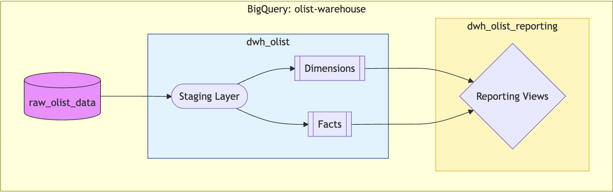
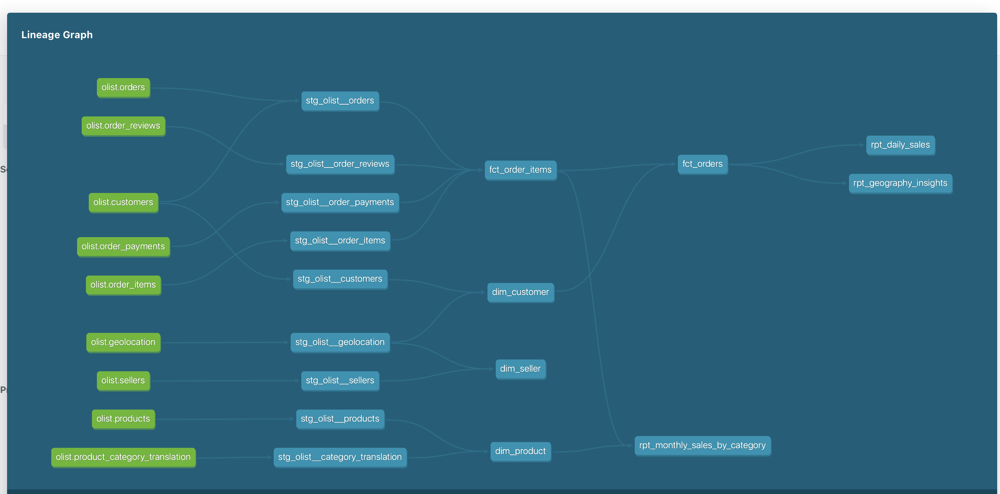
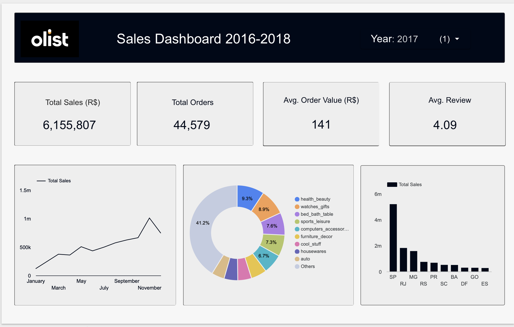

# Olist E-Commerce Analytics Warehouse

**A dbt project transforming the public Olist Brazilian E-Commerce dataset into a clean, tested, Kimball-style star schema on Google BigQuery.**

  
  
  

**Live Documentation** (automatically deployed on every merge):  
[https://mokoul.github.io/Olist-E-Commerce-Analytics-Warehouse/](https://mokoul.github.io/Olist-E-Commerce-Analytics-Warehouse/)   
**Local Docs**: Run `dbt docs generate` → open `target/index.html`  
**Data Source**: [Olist Brazilian E-Commerce Public Dataset (Kaggle)](https://www.kaggle.com/datasets/olistbr/brazilian-ecommerce)  

## Project Overview

This project demonstrates modern analytics engineering best practices using **dbt Core** on **Google BigQuery**.

Raw Olist CSV data is transformed into a fully documented, rigorously tested, and BI-ready dimensional model with:
- A clean staging layer
- Core dimensions and facts in a dedicated `marts` layer
- Downstream reporting views optimized for dashboards

The warehouse handles real-world challenges such as duplicated freight values, inconsistent geolocation, special characters in review text, and late-arriving data, while delivering cost-efficient incremental refreshes.

## Architecture

## Data Preparation

Raw review comments contain special characters that break BigQuery CSV imports. The project includes:

- `notebooks/clean_order_reviews.ipynb`: A Jupyter notebook that removes problematic characters from review titles and messages, converts timestamps, and exports a clean CSV ready for upload.

## Key Features & Best Practices

- **Staging layer**: Consistent naming, light cleaning, source freshness monitoring
- **Surrogate keys**: Deterministic hashes via `dbt_utils.generate_surrogate_key`
- **Freight de-duplication**: Uses `MAX()` to correctly allocate order-level shipping cost
- **Geography enrichment**: Joins geolocation data for city/state/lat/lng at customer level
- **Incremental processing**: Fact tables use `MERGE` strategy with 3-day overlap window to safely handle late-arriving or updated data
- **Cost optimization**: Facts and key staging tables are partitioned (daily on purchase date) and clustered on high-filter columns (`order_status`)
- **Hybrid staging**: Most staging as views (zero storage); critical `stg_olist__orders` materialized and partitioned for maximum pruning benefit
- **Comprehensive documentation**: Detailed model/column descriptions + interactive lineage graph

**Live Documentation** (auto-deployed on every merge to main):  
[https://mokoul.github.io/Olist-E-Commerce-Analytics-Warehouse/](https://mokoul.github.io/Olist-E-Commerce-Analytics-Warehouse/)

## Performance & Cost Optimization 

Fact tables use incremental processing with daily partitioning and clustering for efficient refreshes.

**Benchmark on static Olist dataset (~113k item rows):**

| Scenario                | fct_order_items Scans | fct_orders Scans | Notes |
|-------------------------|-----------------------|------------------|-------|
| Initial full refresh    | 36.1 MiB              | 23.6 MiB         | One-time table creation |
| Incremental (daily)     | 28.6 MiB              | 8.7 MiB          | 3-day lookback window |

**Key findings:**

- 21% reduction in bytes scanned for fct_order_items (36.1 → 28.6 MiB)
- 63% reduction in bytes scanned for fct_orders (23.6 → 8.7 MiB)
- Reporting views remain instant (~2s, 0 bytes processed)

Wall-clock time is similar (~12-15s) on this small dataset due to MERGE overhead, but the 21-63% reduction in scanned bytes directly lowers BigQuery costs—savings that scale significantly with production data growth.

See `docs/performance_incremental.txt` for full benchmark logs.

## Data Quality & Testing

The project includes **~57 tests** (all passing), covering:
- Primary/foreign key integrity (unique, not_null, relationships)
- Accepted values (order status, boolean flags)
- Business logic: no negative prices, shipping, or payments; gross value >= 0; item count >= 1

Critical negative-price checks are configured with `severity: error`.

Run with `dbt test` for zero failures.

## Automation & CI/CD

GitHub Actions provide a fully automated pipeline:

| Workflow              | Trigger                          | Actions                                                                 | Environment   |
|-----------------------|----------------------------------|-------------------------------------------------------------------------|---------------|
| CI/CD Tests           | PRs & branch pushes              | `dbt compile`, selective runs, full tests in dev schema                | BigQuery (dev)|
| Documentation Deploy  | Push to `main`                   | Generates and deploys latest dbt docs to GitHub Pages                   | Public URL    |
| Production Deploy     | Git tag or manual trigger        | Full `dbt run` + tests in production schema                             | BigQuery (prod)|

Benefits: automatic testing on every change, always-current documentation, and safe tagged releases.

## Reporting Views (BI-Ready)

Dedicated schema with pre-aggregated views optimized for dashboards:

| View                              | Key Metrics |
|-----------------------------------|-------------|
| `rpt_daily_sales`                 | Daily orders, revenue, AOV, late delivery %, average review score |
| `rpt_geography_insights`          | Sales, orders, customers by state/city (map-ready) |
| `rpt_monthly_sales_by_category`   | Monthly revenue and units by product category (English names) |

 
## Looker Dashboard (Powered by this dbt project)

A sample executive sales dashboard built in Looker Studio, leveraging the reporting views (`rpt_*`) for insights like total sales, sales trends, category breakdowns, and geography.

## License
This project is licensed under the MIT License.